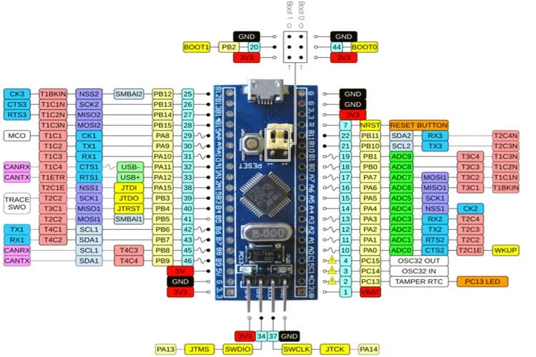

# STM32 Pin Configuration - Beginner's Guide

## 🎯 **What are Pins?**

Think of STM32 pins like **electrical outlets** in your house:
- **Different types** of outlets (for different devices)
- **Each outlet can be used for multiple purposes** with adapters
- **You need to choose the right outlet** for each device

## 📍 **Basic Pin Types in STM32**

### 1. **Power Pins** - Like Main Power Input
```c
VDD  = 3.3V Power Input    // Like main power cord
VSS  = Ground (0V)         // Like ground wire
VDDA = Analog Power        // Clean power for sensors
VSSA = Analog Ground       // Clean ground for sensors
```

**🔌 Example Connection:**
```
Battery 3.3V ──── VDD
                  │
                100nF capacitor
                  │
Battery GND ───── VSS
```

### 2. **GPIO Pins** - Like Programmable Switches
```c
PA0, PA1, PA2... PA15  // Port A pins
PB0, PB1, PB2... PB15  // Port B pins  
PC0, PC1, PC2... PC15  // Port C pins
```

**Each GPIO pin can be:**
- **Input** - Read signals (like reading a button)
- **Output** - Send signals (like lighting an LED)
- **Analog** - Read voltages (like reading a temperature sensor)

## 🔧 **GPIO Pin Modes - Simple Explanation**

### **Mode 1: Output Mode** - Like a Light Switch
```c
// Lighting an LED example
HAL_GPIO_WritePin(GPIOA, GPIO_PIN_5, GPIO_PIN_SET);   // Turn ON
HAL_GPIO_WritePin(GPIOA, GPIO_PIN_5, GPIO_PIN_RESET); // Turn OFF
```

**Circuit:**
```
STM32 PA5 ──── LED ──── Resistor (220Ω) ──── GND
```

### **Mode 2: Input Mode** - Like Reading a Button
```c
// Reading a button example
if (HAL_GPIO_ReadPin(GPIOC, GPIO_PIN_13) == GPIO_PIN_RESET) {
    // Button is pressed
    HAL_GPIO_WritePin(GPIOA, GPIO_PIN_5, GPIO_PIN_SET); // Turn on LED
}
```

**Circuit:**
```
3.3V ──── Resistor (10k) ──── PC13 ──── Button ──── GND
                │
               Button pulls to GND when pressed
```

### **Mode 3: Analog Mode** - Like Reading a Volume Knob
```c
// Reading potentiometer (volume knob) example
uint32_t sensor_value = read_ADC(PA0);  // Read from PA0
// sensor_value will be between 0-4095 (like 0%-100%)
```

**Circuit:**
```
3.3V ──── Potentiometer ──── GND
               │
              PA0 (reads voltage)
```

## 🚀 **Your First Pin Configuration**

### **Step-by-Step LED Blink Example**

```c
#include "stm32f1xx_hal.h"

int main(void) {
    // 1. Initialize HAL Library
    HAL_Init();
    
    // 2. Configure System Clock
    SystemClock_Config();
    
    // 3. Enable GPIOA Clock (IMPORTANT!)
    __HAL_RCC_GPIOA_CLK_ENABLE();
    
    // 4. Configure PA5 as Output
    GPIO_InitTypeDef GPIO_InitStruct = {0};
    GPIO_InitStruct.Pin = GPIO_PIN_5;        // We're using pin PA5
    GPIO_InitStruct.Mode = GPIO_MODE_OUTPUT_PP;  // Output mode
    GPIO_InitStruct.Pull = GPIO_NOPULL;      // No pull-up/down
    GPIO_InitStruct.Speed = GPIO_SPEED_FREQ_LOW; // Low speed for LED
    
    HAL_GPIO_Init(GPIOA, &GPIO_InitStruct);
    
    // 5. Main Loop - Blink LED
    while (1) {
        HAL_GPIO_TogglePin(GPIOA, GPIO_PIN_5);  // Toggle LED
        HAL_Delay(500);  // Wait 500ms
    }
}
```

## 🔄 **Pin Multiplexing - The "Superpower" of STM32**

### **What is Multiplexing?**
Each pin can have **multiple jobs**! Like a Swiss Army knife:

**Example: PA2 pin can be:**
- **GPIO Output** - Turn on an LED
- **USART2_TX** - Send serial data to computer
- **ADC Input** - Read analog sensor
- **Timer Channel** - Generate PWM signal

### **How to Choose the Job:**
```c
// Job 1: Make PA2 a simple output
GPIO_InitStruct.Mode = GPIO_MODE_OUTPUT_PP;

// Job 2: Make PA2 send serial data
GPIO_InitStruct.Mode = GPIO_MODE_AF_PP;
GPIO_InitStruct.Alternate = GPIO_AF7_USART2;  // Choose USART2 function

// Job 3: Make PA2 read analog values  
GPIO_InitStruct.Mode = GPIO_MODE_ANALOG;
```

## 📞 **Communication Pins - Talking to Other Devices**

### **1. UART Pins - Like Simple Walkie-Talkie**
```c
// STM32 talks to computer or other devices
PA2: USART2_TX  // STM32 Transmits (sends data)
PA3: USART2_RX  // STM32 Receives (gets data)
```

**Example: Send "Hello" to computer**
```c
char message[] = "Hello World!\r\n";
HAL_UART_Transmit(&huart2, (uint8_t*)message, strlen(message), 1000);
```

### **2. I2C Pins - Like Talking to Multiple Sensors**
```c
// Connect multiple sensors (temperature, humidity, etc.)
PB6: I2C1_SCL  // Clock line (like rhythm)
PB7: I2C1_SDA  // Data line (like conversation)
```

**Circuit:**
```
STM32 ──── SCL ──── Sensor1 ──── Sensor2 ──── Sensor3
   │
   └─── SDA ──── Sensor1 ──── Sensor2 ──── Sensor3
```

### **3. SPI Pins - Like High-Speed Data Transfer**
```c
// Fast communication with displays, SD cards, etc.
PA5: SPI1_SCK   // Clock
PA6: SPI1_MISO  // Master In Slave Out (STM32 receives)
PA7: SPI1_MOSI  // Master Out Slave In (STM32 sends)
PA4: SPI1_NSS   // Chip select (which device to talk to)
```

## 🔍 **Debugging Pins - Programming and Fixing**

### **SWD Pins (Minimum Required)**
```c
PA13: SWDIO  // Data pin
PA14: SWCLK  // Clock pin
GND: Ground
3.3V: Power (optional)
```

**Why you need them:**
- **Upload your code** to STM32
- **Debug and find errors**
- **View variables while program runs**

## 🛠️ **Practical Examples for Beginners**

### **Example 1: Complete LED and Button Project**
```c
#include "stm32f1xx_hal.h"

void setup_pins(void) {
    // Enable Clocks (Turn on the power for ports)
    __HAL_RCC_GPIOA_CLK_ENABLE();
    __HAL_RCC_GPIOC_CLK_ENABLE();
    
    // Configure LED on PA5 as Output
    GPIO_InitTypeDef gpio;
    gpio.Pin = GPIO_PIN_5;
    gpio.Mode = GPIO_MODE_OUTPUT_PP;
    gpio.Pull = GPIO_NOPULL;
    gpio.Speed = GPIO_SPEED_FREQ_LOW;
    HAL_GPIO_Init(GPIOA, &gpio);
    
    // Configure Button on PC13 as Input
    gpio.Pin = GPIO_PIN_13;
    gpio.Mode = GPIO_MODE_INPUT;
    gpio.Pull = GPIO_PULLUP;  // Internal pull-up resistor
    HAL_GPIO_Init(GPIOC, &gpio);
}

int main(void) {
    HAL_Init();
    SystemClock_Config();
    setup_pins();
    
    while (1) {
        // If button pressed (goes to LOW), turn on LED
        if (HAL_GPIO_ReadPin(GPIOC, GPIO_PIN_13) == GPIO_PIN_RESET) {
            HAL_GPIO_WritePin(GPIOA, GPIO_PIN_5, GPIO_PIN_SET);  // LED ON
        } else {
            HAL_GPIO_WritePin(GPIOA, GPIO_PIN_5, GPIO_PIN_RESET); // LED OFF
        }
        
        HAL_Delay(50);  // Check button every 50ms
    }
}
```

### **Example 2: Simple Serial Communication**
```c
void setup_serial(void) {
    // Enable clocks
    __HAL_RCC_GPIOA_CLK_ENABLE();
    
    // Configure PA2 and PA3 for serial communication
    GPIO_InitTypeDef gpio;
    gpio.Pin = GPIO_PIN_2 | GPIO_PIN_3;  // Both pins at once
    gpio.Mode = GPIO_MODE_AF_PP;         // Alternate function
    gpio.Pull = GPIO_NOPULL;
    gpio.Speed = GPIO_SPEED_FREQ_HIGH;
    gpio.Alternate = GPIO_AF7_USART2;    // USART2 function
    HAL_GPIO_Init(GPIOA, &gpio);
}

void send_message(char* text) {
    // Send text to computer via serial
    HAL_UART_Transmit(&huart2, (uint8_t*)text, strlen(text), 1000);
}
```

## 📋 **Beginner's Checklist**

### **Before Using Any Pin:**
1. ✅ **Enable the clock** for that GPIO port
2. ✅ **Choose the right mode** (Input/Output/Analog)
3. ✅ **Check the circuit** (add resistors if needed)
4. ✅ **Test with simple code** first

### **Common Mistakes to Avoid:**
1. ❌ **Forgetting to enable clock** (most common mistake!)
2. ❌ **Short-circuiting pins** (always use current-limiting resistors)
3. ❌ **Using wrong pin mode** (Input vs Output vs Analog)
4. ❌ **Not checking pin availability** (some pins have special functions)

## 🎓 **Quick Reference Guide**

### **GPIO Modes:**
| Mode | Purpose | Example Use |
|------|---------|-------------|
| `OUTPUT_PP` | Output signal | LEDs, relays |
| `INPUT` | Read digital signal | Buttons, switches |
| `ANALOG` | Read voltage | Sensors, potentiometers |
| `AF_PP` | Special functions | Serial, SPI, I2C |

### **Essential Pins for Every Project:**
1. **VDD/VSS** - Power supply (3.3V and GND)
2. **PA13/PA14** - Programming (SWD) 
3. **NRST** - Reset button
4. **Your chosen GPIO** - For your specific project

### **Simple Rule of Thumb:**
- **Want to control something?** → Use **OUTPUT** mode
- **Want to read a switch?** → Use **INPUT** mode with pull-up
- **Want to read a sensor voltage?** → Use **ANALOG** mode
- **Want to communicate?** → Use **ALTERNATE FUNCTION** mode

## 🚀 **Next Steps**

1. **Start with simple LED blink** - Master basic output
2. **Add a button** - Learn input reading
3. **Try serial communication** - Talk to computer
4. **Experiment with sensors** - Read analog values

5. **Use STM32CubeMX** - Let the tool help you configure pins
